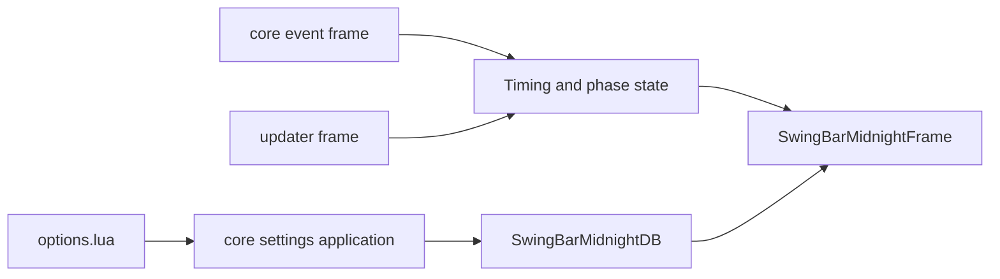

# Code graph

```mermaid
flowchart LR
  Events[core event frame] --> Timing[Timing and phase state]
  Timing --> Frame[SwingBarMidnightFrame]
  Updater[updater frame] --> Timing
  Options[options.lua] --> Apply[core settings application]
  Apply --> DB[SwingBarMidnightDB]
  DB --> Frame
```
