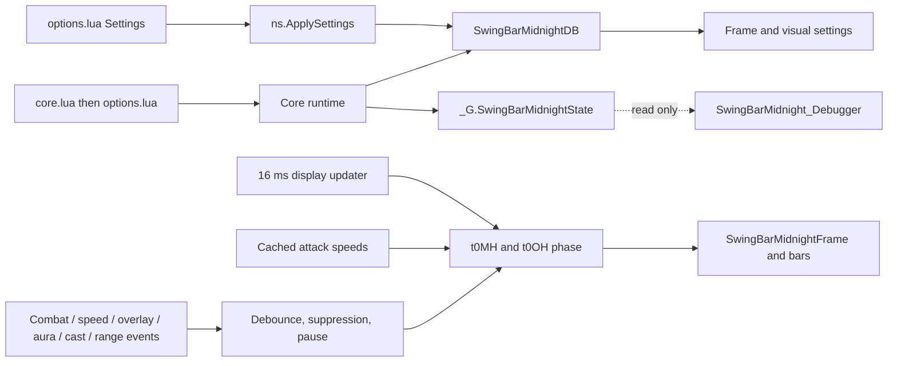

# Code graph

```mermaid
flowchart LR
  TOC[core.lua then options.lua] --> Core[Core runtime]
  Core --> DB[SwingBarMidnightDB]
  DB --> Layout[Frame and visual settings]
  Events[Combat / speed / overlay / aura / cast / range events] --> Gate[Debounce, suppression, pause]
  Gate --> Phase[t0MH and t0OH phase]
  Speed[Cached attack speeds] --> Phase
  Updater[16 ms display updater] --> Phase
  Phase --> Frame[SwingBarMidnightFrame and bars]
  Options[options.lua Settings] --> Apply[ns.ApplySettings]
  Apply --> DB
  Core --> State[_G.SwingBarMidnightState]
  State -. read only .-> Debugger[SwingBarMidnight_Debugger]
```
