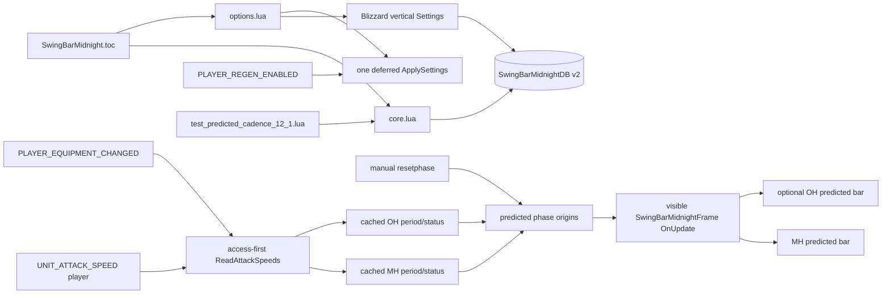

# SwingBarMidnight code graph

```mermaid
flowchart LR
  T["SwingBarMidnight.toc"] --> C["core.lua"]
  T --> O["options.lua"]
  C --> DB[("SwingBarMidnightDB v2")]
  U["UNIT_ATTACK_SPEED player"] --> A["access-first ReadAttackSpeeds"]
  E["PLAYER_EQUIPMENT_CHANGED"] --> A
  A --> MH["cached MH period/status"]
  A --> OH["cached OH period/status"]
  MH --> P["predicted phase origins"]
  OH --> P
  P --> F["visible SwingBarMidnightFrame OnUpdate"]
  F --> BM["MH predicted bar"]
  F --> BO["optional OH predicted bar"]
  R["manual resetphase"] --> P
  G["PLAYER_REGEN_ENABLED"] --> AP["one deferred ApplySettings"]
  O --> S["Blizzard vertical Settings"]
  S --> DB
  O --> AP
  X["test_predicted_cadence_12_1.lua"] --> C
```

The graph has no aura, overlay, action-slot, range, timer, combat-log, or actual-hit event. Output is prediction only.
